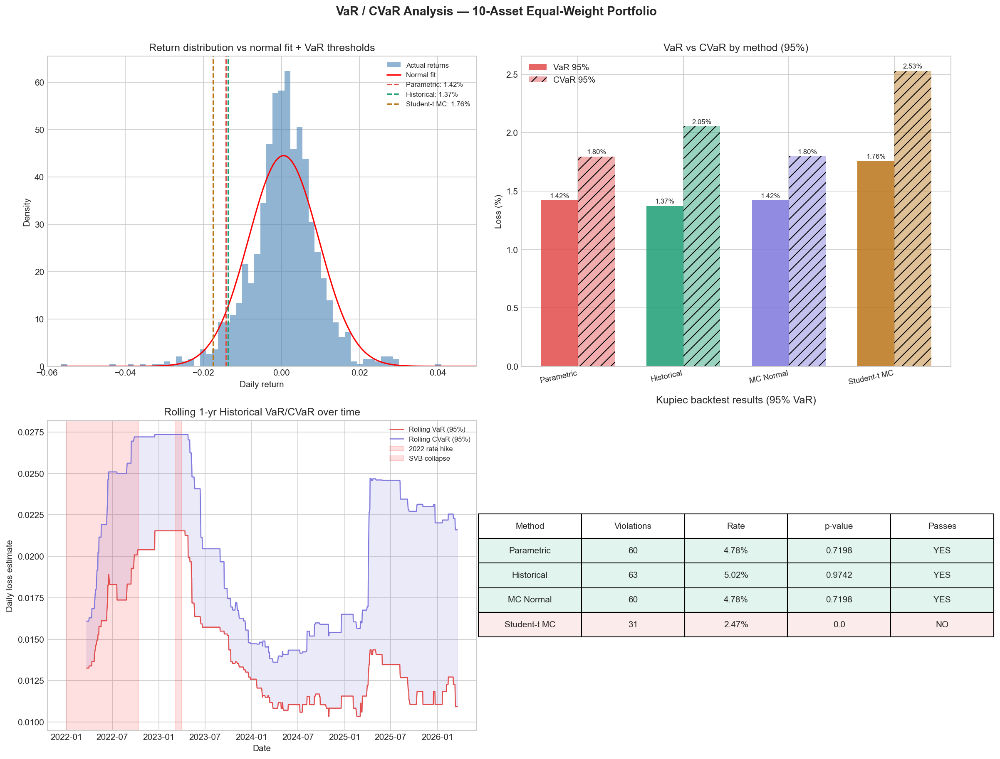
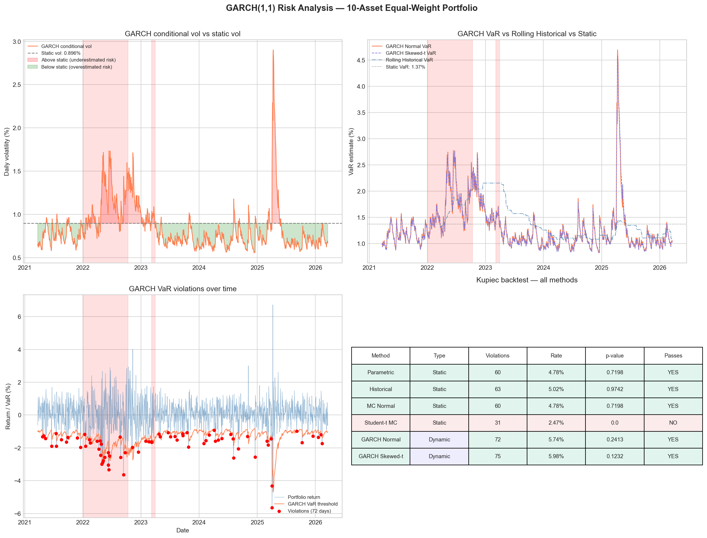
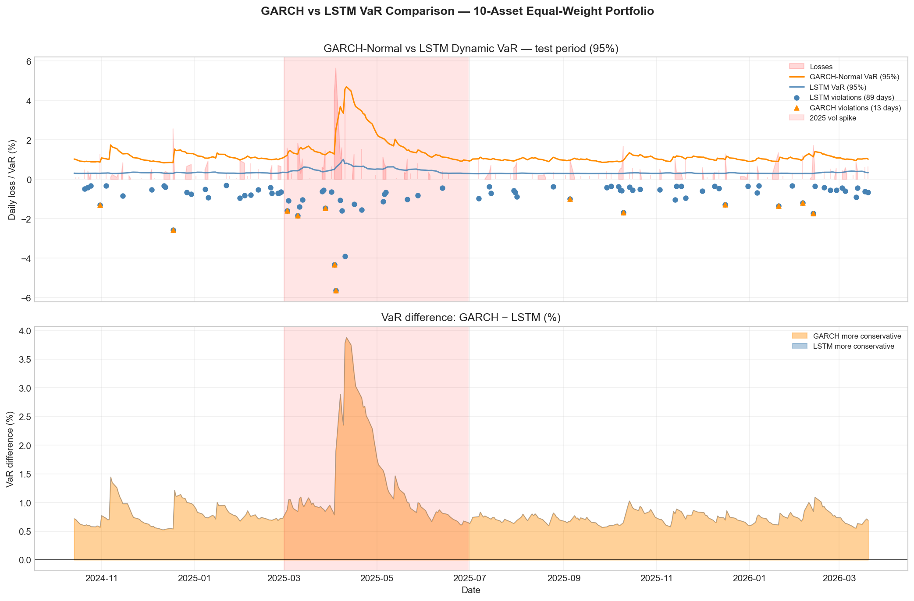

# Risk Modeling & Portfolio Analysis

A comparative study of risk estimation methods for a 10-asset equity portfolio, ranging from classical parametric models to deep learning. This is a portfolio project targeting data science roles in quantitative finance.

---

## Portfolio

**10-asset equal-weight portfolio:** AAPL, MSFT, GOOGL, JPM, GS, JNJ, PFE, XOM, CVX, BND

**Data:** 5-year daily prices via yfinance (~1,255 trading days, Mar 2021 – Mar 2026)

**Key stats:**
- Daily mean return: 0.0005 | Daily std: 0.0090
- Annualized return: 13.5% | Annualized vol: 14.2%
- Skewness: -0.1283 (losses more extreme than gains)
- Kurtosis: 5.3167 (fat tails confirmed — normal distribution is inadequate)
- Average pairwise correlation: ~0.22 calm, spikes toward 1.0 in crises

---

## Method Progression

Each level addresses a specific failure of the previous one:

| Level | Method | Key Limitation Addressed |
|-------|--------|--------------------------|
| 1 | Parametric VaR | Baseline — assumes normality |
| 2 | Historical VaR | No distribution assumption |
| 3 | Monte Carlo VaR (Normal) | Flexible simulation |
| 4 | Student-t Monte Carlo | Fat tail correction |
| 5 | Cornish-Fisher VaR | Skewness + kurtosis correction |
| 6 | GARCH(1,1) VaR | Dynamic volatility |
| 7 | LSTM VaR | Learned volatility dynamics |
| 8 | Transformer VaR | Attention over return sequence |

---

## Results

###  1 — VaR / CVaR Analysis



This 4-panel figure summarizes static risk model results:

- **Top-left — Return distribution vs normal fit:** The histogram of daily portfolio returns is overlaid with a fitted normal curve. The vertical dashed lines mark the VaR thresholds for each method. The actual return distribution is visibly taller at the center and heavier in the left tail than the normal curve — confirming the fat-tail and negative-skew findings from EDA. The VaR lines cluster tightly except for Student-t MC, which sits noticeably further left (more conservative).

- **Top-right — VaR vs CVaR by method (bar chart):** Compares VaR 95% (solid) and CVaR 95% (hatched) side by side for all four methods. CVaR is always larger than VaR — it measures the expected loss *given* you've already breached VaR. The gap is widest for Historical and Student-t MC, where fat tails add more mass to the extreme left tail beyond the VaR cutoff.

- **Bottom-left — Rolling 1-yr Historical VaR/CVaR over time:** Tracks how risk estimates evolved from 2022 to 2026. The shaded bands mark the 2022 rate hike and the 2023 SVB collapse. VaR roughly doubled during the 2022 hike and stayed elevated through 2023 before declining. This shows that a single static VaR number conceals enormous regime variation.

- **Bottom-right — Kupiec backtest table:** Formal statistical test of each model's violation rate. Parametric, Historical, and MC Normal all pass (p > 0.05). Student-t MC fails — 31 violations vs ~63 expected — because its fat-tail assumption is so conservative it almost never triggers.

### VaR / CVaR Comparison (95% confidence, $100k portfolio)

| Method | VaR 95% | CVaR 95% | Dollar VaR | Kupiec |
|--------|---------|----------|------------|--------|
| Parametric | 1.421% | 1.796% | $1,421 | PASS |
| Historical | 1.373% | 2.053% | $1,373 | PASS |
| MC Normal | 1.420% | 1.797% | $1,420 | PASS |
| Student-t MC | 1.757% | 2.529% | $1,757 | FAIL |
| Cornish-Fisher (99%) | 3.225% | 3.502% | — | — |

**Key findings:**
- Historical VaR is best calibrated: 5.02% violation rate vs 5.00% expected
- Student-t overcorrects (df=5.13) — too conservative, fails Kupiec
- Cornish-Fisher is unstable at 95%, more reliable at 99%
- CVaR gap is where fat tails reveal themselves: Parametric $1,796 vs Student-t $2,529
- Rolling VaR doubled during the 2022 rate hike period

###  2 — GARCH Risk Analysis



This 4-panel figure covers the GARCH(1,1) dynamic volatility model:

- **Top-left — GARCH conditional vol vs static vol:** The orange line is GARCH's time-varying daily volatility estimate. The flat green line is the static historical vol (0.896% every day). Crisis periods are shaded in pink. GARCH compresses risk estimates in calm periods and spikes sharply during stress — peaking at ~2.9% in the 2025 vol spike, well above anything seen in 2022. Static vol misses all of this variation entirely.

- **Top-right — GARCH VaR vs Rolling Historical VaR vs Static VaR:** All three VaR time series plotted together. GARCH (orange/purple) reacts much faster than the rolling historical window (blue) — capturing stress within days rather than weeks. Static VaR (flat green line at 1.37%) is blind to all regime changes. During the 2025 spike, GARCH VaR reached ~4.5–4.7%, more than 3x the static estimate.

- **Bottom-left — GARCH VaR violations over time:** Daily portfolio returns (blue) plotted against the GARCH VaR threshold (orange). Red dots mark days where the return breached VaR. Violations are scattered across the full sample with slight clustering around crisis periods — the expected pattern for a well-calibrated dynamic model.

- **Bottom-right — Full Kupiec backtest table (all methods):** Consolidates static and dynamic results. GARCH Normal (72 violations, 5.74%) and GARCH Skewed-t (75 violations, 5.98%) both pass, with violation rates close to the theoretical 5%. Student-t MC remains the only failure.

### GARCH Results

| Parameter | Normal GARCH | Skewed-t GARCH |
|-----------|--------------|----------------|
| omega | 0.0304 | 0.0227 |
| alpha[1] | 0.0946 | 0.0858 |
| beta[1] | 0.8649 | 0.8837 |
| alpha + beta | 0.9595 | 0.9695 |
| half-life | 16.8 days | 22.4 days |
| AIC | 3044.43 | 2993.90 |

Skewed-t parameters: eta=7.65 (fat tails), lambda=-0.104 (negative skew)

| Method | Mean VaR | Min VaR | Max VaR | Violations | Kupiec |
|--------|----------|---------|---------|------------|--------|
| GARCH Normal | 1.312% | 0.837% | 4.696% | 72 (5.74%) | PASS |
| GARCH Skewed-t | 1.309% | 0.824% | 4.578% | 75 (5.98%) | PASS |

**Key findings:**
- 5.2x volatility range (0.556% calm → 2.901% crisis) vs static 0.896%
- 3.4x peak VaR vs static — $3,323 difference on worst day per $100k
- 2025 spike to 2.9% was the highest in the entire sample — exceeded 2022 levels
- Skewed-t wins AIC/BIC by ~50 points over normal GARCH

###  3 — GARCH vs LSTM VaR Comparison



This 2-panel figure compares GARCH and LSTM during the test period (late 2024 – early 2026):

- **Top — Dynamic VaR time series (test period):** The orange band is GARCH-Normal VaR (95%), the blue line is LSTM VaR (95%), and dots mark violations for each model. During the 2025 vol spike (pink shaded region), GARCH reacts aggressively — VaR surges to ~4–5% — while LSTM is more measured. Outside of the spike, LSTM and GARCH track closely. Orange dots (GARCH violations) are fewer during the spike than blue dots (LSTM violations), indicating GARCH's larger threshold catches more extreme moves during stress.

- **Bottom — VaR difference (GARCH minus LSTM):** Orange fill means GARCH is more conservative; blue fill means LSTM is more conservative. The dominant pattern is orange — GARCH almost always produces a higher VaR than LSTM. The spike in early 2025 is extreme: GARCH exceeded LSTM VaR by over 3.5 percentage points at peak. Outside stress periods, the gap narrows to ~0.5–1%, meaning both models agree in calm markets but diverge sharply when it matters most.

---

## Project Structure

```
RiskManagement/
├── risk_management.ipynb        ← EDA + VaR/CVaR + GARCH (all in one)
├── src/
│   ├── data_loader.py
│   ├── risk_metrics.py
│   ├── garch_var.py
│   └── lstm_model.py
├── var_cvar_summary.png         ← Figure 1: static VaR/CVaR comparison
├── garch_summary.png            ← Figure 2: GARCH dynamic vol analysis
├── lstm_vs_garch.png            ← Figure 3: LSTM vs GARCH comparison
├── run_analysis.py
├── requirements.txt
└── CLAUDE_CONTEXT.md            ← full project context for AI-assisted development
```

---

## Setup

```bash
pip install -r requirements.txt
```

**Dependencies:** yfinance, numpy, pandas, matplotlib, seaborn, scipy, arch, torch

---

## What's Next

- [ ] **Notebook 04** — LSTM volatility forecaster (2-layer LSTM, window=20, softplus output)
- [ ] **Notebook 05** — Transformer VaR (self-attention over return sequence)
- [ ] **Notebook 06** — Unified comparison table across all methods
- [ ] **Streamlit dashboard** — interactive VaR/CVaR explorer, efficient frontier, GARCH vol chart

### Planned extensions
- HMM regime detection (2-state Gaussian HMM, regime-conditional VaR)
- GJR-GARCH (asymmetric — negative shocks increase vol more)
- Hierarchical Risk Parity (HRP) portfolio
- Black-Litterman optimization
- XGBoost regime classifier

---

## Evaluation Framework

All methods are backtested using the **Kupiec likelihood ratio test** — a formal statistical test for whether the observed violation rate is consistent with the model's confidence level (χ² test, df=1, α=0.05).

Dynamic models (GARCH, LSTM, Transformer) are additionally evaluated on **vol forecast MSE** against realized volatility (|r_t|).

